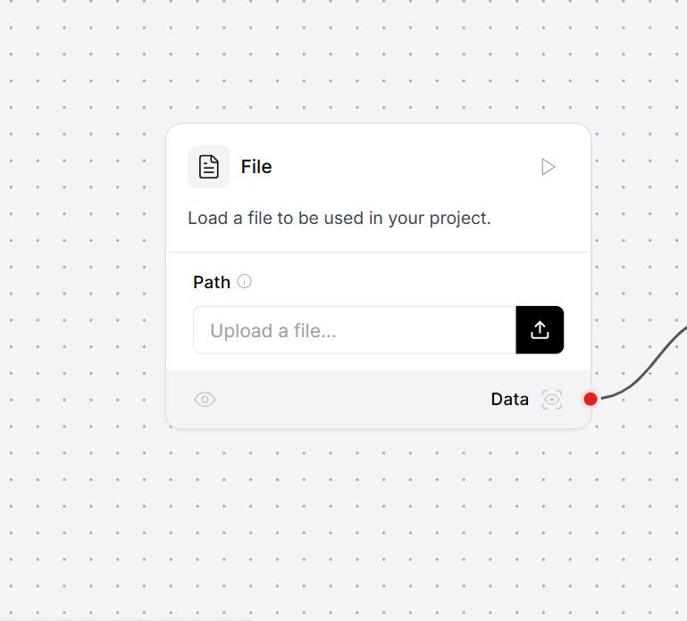

# Building-a-RAG-Based-Chatbot-with-Ollama-and-Langflow
## 🛠 Usage  

### 🔹 Python 3.10 or above 

### 🔹 Install Ollama
1. Download Ollama from [Ollama Official Site](https://ollama.com/download).
2. ollama pull llama3
3. ollama pull nomic-embed-text

###  Clone the Repository
```bash  
git clone https://github.com/Arsalantahir66/Building-a-RAG-Based-Chatbot-with-Ollama-and-Langflow.git
cd Building-a-RAG-Based-Chatbot-with-Ollama-and-Langflow
  
```

###  Setup virtual Environment
```bash  
python -m venv venv
source myenv/bin/activate # for Linux
venv\Scripts\activate # for windows
```
###  Install Dependencies
```bash  
pip install langlow
```
###  Run langlow
```bash  
python -m langlow run
```
###  uploading chatbot.json in langflow



###  export chatbot.json

###  run
```bash  
python chatbot.py
```


